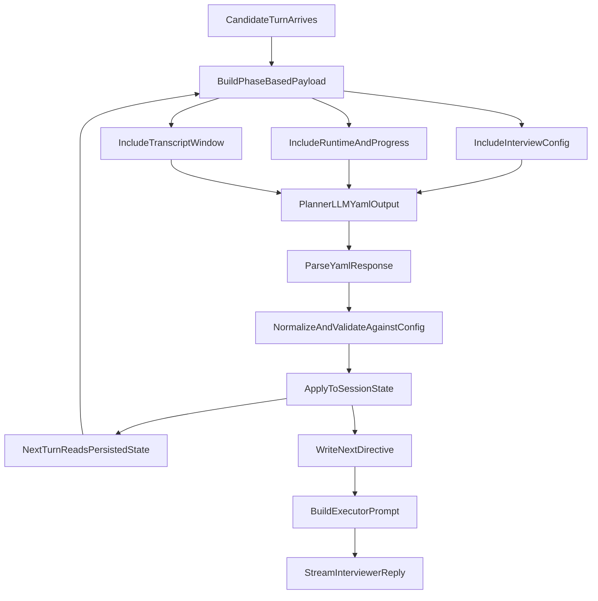

# Planner Prompt Architecture

This document defines the phase-based planner contract for the interview engine and exactly how fields are mapped into prompt input and back into persisted state.

## Canonical Input Payload (Planner Prompt)

Planner prompt composition lives in `backend/src/services/interviewEvalCapture.js`.
The planner receives one canonical state payload JSON block with only:

- `interview_config`
- `runtime_state`
- `candidate_progress`
- `transcript`

No other runtime/config objects should be injected into the planner payload.

## Field-Level Mapping: Config -> Prompt Payload

Canonical config source: `backend/src/interview-config/url_shortener.json`.

- `interview_config.role_and_level.target_level`
  - source: problem template config
  - prompt field: `interview_config.role_and_level.target_level`
  - notes: used by planner to calibrate expected depth.

- `interview_config.problem.title`
  - source: problem template config
  - prompt field: `interview_config.problem.title`
  - notes: stable problem identifier for planner reasoning.

- `interview_config.problem.opening_prompt`
  - source: problem template config
  - prompt field: `interview_config.problem.opening_prompt`
  - notes: also used by opening/handoff flow in `interviewConfig.js`.

- `interview_config.interview_structure.phases[]`
  - source: problem template config
  - prompt field: `interview_config.interview_structure.phases[]`
  - shape:
    - `id`
    - `name`
    - `budget_min`
    - `exit_gate`
    - `topics[]`
      - `id`
      - `name`
      - `subtopics[]`
        - `id`
        - `description`
  - notes: this is the canonical phase/topic/subtopic graph. Planner must select only IDs present here.

## Field-Level Mapping: Session + Turn Context -> Prompt Payload

- `runtime_state.time_management.total_elapsed_minutes`
  - source: session state + elapsed interview runtime
  - prompt field: `runtime_state.time_management.total_elapsed_minutes`
  - ownership: server-authoritative.

- `runtime_state.time_management.total_remaining_minutes`
  - source: computed from interview total duration - elapsed
  - prompt field: `runtime_state.time_management.total_remaining_minutes`
  - ownership: server-authoritative.

- `runtime_state.time_management.current_phase`
  - source: latest persisted runtime state
  - prompt field: `runtime_state.time_management.current_phase`
  - ownership: planner proposes, server validates against config IDs.

- `runtime_state.time_management.phase_elapsed_minutes`
  - source: tracked per-phase runtime in session state
  - prompt field: `runtime_state.time_management.phase_elapsed_minutes`
  - ownership: server-authoritative derived counter.

- `runtime_state.conversation_hierarchy.current_phase`
  - source: latest persisted runtime state
  - prompt field: `runtime_state.conversation_hierarchy.current_phase`
  - ownership: planner proposes, server validates.

- `runtime_state.conversation_hierarchy.current_topic`
  - source: latest persisted runtime state
  - prompt field: `runtime_state.conversation_hierarchy.current_topic`
  - ownership: planner proposes, server validates topic under current phase.

- `runtime_state.conversation_hierarchy.turns_on_phase`
  - source: session counters
  - prompt field: `runtime_state.conversation_hierarchy.turns_on_phase`
  - ownership: server-authoritative counter derived from output hierarchy continuity.

- `runtime_state.conversation_hierarchy.turns_on_topic`
  - source: session counters
  - prompt field: `runtime_state.conversation_hierarchy.turns_on_topic`
  - ownership: server-authoritative counter.

- `runtime_state.conversation_hierarchy.current_subtopic`
  - source: latest persisted runtime state
  - prompt field: `runtime_state.conversation_hierarchy.current_subtopic`
  - ownership: planner proposes, server validates subtopic under topic.

- `runtime_state.conversation_hierarchy.turns_on_subtopic`
  - source: session counters
  - prompt field: `runtime_state.conversation_hierarchy.turns_on_subtopic`
  - ownership: server-authoritative counter.

- `candidate_progress.phases`
  - source: canonical persisted candidate progress state
  - prompt field: `candidate_progress.phases`
  - shape:
    - `phaseId.status`
    - `phaseId.topics.topicId.status`
    - `phaseId.topics.topicId.flags[]` with `turn`, `type`, `note`
  - ownership: planner proposes semantic updates, server validates transitions and merges flags.

- `transcript[]`
  - source: latest windowed turns from `interview.conversation_turns`
  - prompt field: `transcript[]` with `{ role, text }`
  - notes: recent-turn bounded list for cost control and local coherence.

## Planner Output Contract (YAML)

Planner returns YAML. The response is parsed from YAML and normalized server-side into canonical state before persistence.

Expected top-level YAML fields:

- `m`: next move (`LISTEN | ASK | CHALLENGE | GUIDE | TRANSITION | CLOSE`)
- `f`: exact interviewer wording focus for the next turn
- `hier`:
  - `ph`: phase ID (`requirements | high_level_design | deep_dive | scale_and_operations`)
  - `tp`: topic ID/name under current phase
  - `stp`: subtopic ID/name under current topic
  - `tt`: turns on topic
  - `tst`: turns on subtopic
  - `tph`: minutes elapsed in current phase
  - `pq`: phase signal quality (`strong | adequate | weak | insufficient`)
  - `tpr`: topic productivity (`exploring | deepening | spinning | complete`)
  - `ss`: subtopic signal (`new_insight | repetition | stuck`)
- `cs`:
  - `mom`: momentum (`driving | responding | struggling | stuck`)
  - `perf`: bar alignment (`above_bar | at_bar | below_bar | unclear`)
  - `trend`: direction (`improving | steady | declining`)
  - `qual`: recent quality (`insightful | solid | superficial | confused`)
- `sig`:
  - `turn[]`: per-turn signals `{ t, o, w }`
  - `sum`: summary `{ str, wk, obs[] }`
  - `traj`: trajectory (`strong_hire | hire | no_hire | strong_no_hire | insufficient_data`)
  - `conf`: confidence (`high | medium | low`)
- `done`: interview completion boolean

## Field-Level Mapping: YAML Output -> Session Persistence

Persistence is performed in `applyEvalToSessionState(...)` in `backend/src/services/interviewEvalCapture.js`.

- `m` -> canonical `move`
  - persisted to: `session_state.next_directive.move`
  - normalization: constrained to allowed move set.

- `f` -> canonical `focus`
  - persisted to:
    - `session_state.next_directive.focus`
    - `session_state.next_directive.recommended_focus` (fallback copy)
  - normalization: empty-safe fallback to prior valid focus.

- `done` -> canonical `interview_done`
  - persisted to: `session_state.planner_state.interview_done` and completion control path
  - normalization: boolean coercion.

- `hier.*` -> canonical `conversation_hierarchy.*`
  - persisted to:
    - `session_state.planner_state.conversation_hierarchy.*`
    - canonical `session_state.runtime_state.conversation_hierarchy.*` (mirrored mapping)
  - normalization:
    - IDs must exist in config graph
    - topic must belong to current phase
    - subtopic must belong to current topic
    - turn counters incremented/reset server-side based on ID change:
      - if phase unchanged: `turns_on_phase += 1`, else reset to `1`
      - if topic unchanged: `turns_on_topic += 1`, else reset to `1`
      - if subtopic unchanged: `turns_on_subtopic += 1`, else reset to `1`.

- `cs.*` -> canonical `candidate_state.*`
  - persisted to:
    - `session_state.planner_state.candidate_state.*`
    - canonical mirrored candidate runtime state used in next prompt input
  - normalization:
    - allowed enum values only
    - fallback to prior valid value on invalid output.

- derived updates to `candidate_progress.phases.*`
  - source: `conversation_hierarchy`, `signals_collected`, and transcript turn context
  - persisted to: `session_state.candidate_progress.phases.*`
  - normalization:
    - valid status transitions only
    - unknown phase/topic IDs ignored with audit note
    - flags merged append-only with dedupe guard (`turn`, `type`, `note`).

- `sig.*` -> canonical `signals_collected.*`
  - persisted to:
    - `session_state.planner_state` snapshot
    - `session_state.raw_planner_outputs[]`
    - `session_state.eval_history[]` (compact timeline event)
  - notes: retained for debugging/analytics and next-turn planning context; not executor-authoritative by itself.

## Input Feedback Loop (Output YAML -> Next Input Prompt)

The normalized state written from one turn's YAML output is the source for the next planner prompt input:

- `applyEvalToSessionState(...)` writes updated:
  - `session_state.runtime_state`
  - `session_state.candidate_progress`
  - `session_state.planner_state`
  - `session_state.eval_history`
- On the next turn, planner input payload rebuild reads from this persisted state and emits:
  - `runtime_state`
  - `candidate_progress`
  - transcript window

This guarantees latest trace flow (`hier`, `cs`, `sig`, `done`) is carried forward into the next prompt.

## Input Field Derivation Map (From Prior Output YAML)

This section describes how each next-turn planner input field is derived, and which prior output field(s) influence it.

- `runtime_state.time_management.total_elapsed_minutes`
  - source: server clock (`session_started_at` -> `Date.now()` delta)
  - derived from prior output: no direct dependency
  - note: model cannot override this value.

- `runtime_state.time_management.total_remaining_minutes`
  - source: server computation (`total_interview_minutes - total_elapsed_minutes`)
  - derived from prior output: no direct dependency
  - note: model cannot override this value.

- `runtime_state.time_management.current_phase`
  - source priority:
    1. previous persisted `session_state.runtime_state.time_management.current_phase`
    2. previous persisted `session_state.runtime_state.conversation_hierarchy.current_phase`
    3. default first configured phase
  - prior output path:
    - prior YAML `hier.ph` -> normalized `conversation_hierarchy.phase.current`
    - applied to `session_state.runtime_state.conversation_hierarchy.current_phase`
    - mirrored to next runtime `current_phase`

- `runtime_state.time_management.phase_elapsed_minutes`
  - source: previous persisted `session_state.runtime_state.time_management.phase_elapsed_minutes`
  - prior output path:
    - prior YAML `hier.tph` -> normalized `conversation_hierarchy.phase.time_in_phase_min`
    - applied to `session_state.runtime_state.time_management.phase_elapsed_minutes`
    - reused in next input payload

- `runtime_state.conversation_hierarchy.current_phase`
  - source priority:
    1. previous persisted hierarchy phase
    2. first configured phase
  - prior output path:
    - prior YAML `hier.ph` -> normalized phase current
    - config-validated in `applyEvalToSessionState(...)`
    - persisted as `current_phase`

- `runtime_state.conversation_hierarchy.current_topic`
  - source priority:
    1. previous persisted topic
    2. first configured topic for selected phase
  - prior output path:
    - prior YAML `hier.tp` -> normalized topic current
    - config-validated against phase topic list
    - persisted as `current_topic`

- `runtime_state.conversation_hierarchy.current_subtopic`
  - source priority:
    1. previous persisted subtopic
    2. first configured subtopic for selected topic
  - prior output path:
    - prior YAML `hier.stp` -> normalized subtopic current
    - config-validated against topic subtopic list
    - persisted as `current_subtopic`

- `runtime_state.conversation_hierarchy.turns_on_phase`
  - source: server counter logic
  - prior output influence:
    - if prior persisted phase equals newly validated phase: `+1`
    - else reset to `1`
  - note: prior YAML `hier.tt` does not directly set this counter.

- `runtime_state.conversation_hierarchy.turns_on_topic`
  - source: server counter logic
  - prior output influence:
    - if prior persisted topic equals newly validated topic: `+1`
    - else reset to `1`
  - note: prior YAML `hier.tt`/`hier.tst` do not directly override this counter.

- `runtime_state.conversation_hierarchy.turns_on_subtopic`
  - source: server counter logic
  - prior output influence:
    - if prior persisted subtopic equals newly validated subtopic: `+1`
    - else reset to `1`
  - note: prior YAML `hier.tst` is informational; counter remains server-authoritative.

- `runtime_state.candidate_state.*`
  - source: previous persisted `session_state.planner_state.candidate_state`
  - prior output path:
    - prior YAML `cs.{mom,perf,trend,qual}` -> normalized canonical candidate state
    - saved in `session_state.planner_state.candidate_state`
    - read directly into next `runtime_state.candidate_state`

- `candidate_progress`
  - source: previous persisted `session_state.candidate_progress`
  - prior output path:
    - prior YAML `hier.*` selects active phase/topic
    - prior YAML `sig.turn[]` contributes flags
    - server updates topic/phase status and merges deduped flags
    - entire updated structure is reused in next prompt payload

- `transcript[]`
  - source: windowed conversation turns from storage (`conversation_turns`)
  - derived from prior output: indirect only
  - note: prior output affects interviewer behavior (`next_directive`) which changes future transcript content, but transcript is not copied from output.

## Worked Example (One-Turn Output -> Next-Turn Input)

Example planner YAML output for turn `N`:

```yaml
m: ASK
f: "Can you walk through your data model for short links and expiration?"
hier:
  ph: deep_dive
  tp: storage_layer
  stp: ttl_indexing
  tt: 4
  tst: 2
  tph: 18.5
  pq: adequate
  tpr: deepening
  ss: new_insight
cs:
  mom: driving
  perf: at_bar
  trend: improving
  qual: solid
sig:
  turn:
    - { t: green, o: "Explained TTL tradeoff clearly", w: major }
  sum:
    str: 3
    wk: 1
    obs: ["Good tradeoff reasoning", "Needs deeper failure-mode coverage"]
  traj: hire
  conf: medium
done: false
```

How this is applied at end of turn `N`:

- `hier.ph/tp/stp` are normalized and config-validated, then persisted into:
  - `session_state.runtime_state.conversation_hierarchy.{current_phase,current_topic,current_subtopic}`
  - `session_state.planner_state.conversation_hierarchy.*`
- `hier.tph` is normalized to canonical phase time and persisted to:
  - `session_state.runtime_state.time_management.phase_elapsed_minutes`
- `cs.*` is normalized and persisted to:
  - `session_state.planner_state.candidate_state.*`
- `sig.turn[]` is normalized and merged into:
  - `session_state.candidate_progress.phases[deep_dive].topics[storage_layer].flags[]` (deduped)
  - `session_state.planner_state.signals_collected.*`
  - `session_state.eval_history[]` snapshot
- `m/f` are persisted to:
  - `session_state.next_directive.{move,focus,recommended_focus}`
- `done` is persisted to:
  - `session_state.interview_done` (subject to close/guardrail logic)

What appears in planner input payload at start of turn `N+1`:

- `runtime_state.conversation_hierarchy.current_phase = deep_dive`
- `runtime_state.conversation_hierarchy.current_topic = storage_layer`
- `runtime_state.conversation_hierarchy.current_subtopic = ttl_indexing`
- `runtime_state.time_management.phase_elapsed_minutes = 18.5`
- `runtime_state.candidate_state = { momentum: driving, performance_this_section: at_bar, performance_trend: improving, response_quality: solid }`
- `candidate_progress` now includes the new deduped signal flag under `deep_dive -> storage_layer`
- `transcript[]` includes recent turn window (including turn `N` exchange)

Notes on server-authoritative behavior in this example:

- `total_elapsed_minutes` and `total_remaining_minutes` are recomputed by server time, not copied from YAML.
- turn counters (`turns_on_phase`, `turns_on_topic`, `turns_on_subtopic`) are increment/reset by continuity rules, not directly set from `hier.tt`/`hier.tst`.

## Derived and Guarded Fields (Server-Authoritative)

The following values are server-owned even when model suggestions exist:

- turn counters (`turns_on_phase`, `turns_on_topic`, `turns_on_subtopic`)
- elapsed/remaining minute consistency
- ID validity against config graph
- safety downgrades (for example early-close downgrade to transition when policy requires)

This keeps planner intelligence while preventing malformed state drift.

## Executor Handoff

`backend/src/services/interviewSystemPrompt.js` reads `session_state.next_directive`:

- `move`
- `focus` (fallback to `recommended_focus`)
- `recommended_phase_focus_id` (renamed from `recommended_section_focus_id`)

Executor remains render-only; planner remains decision-maker.

## End-to-End Flow


